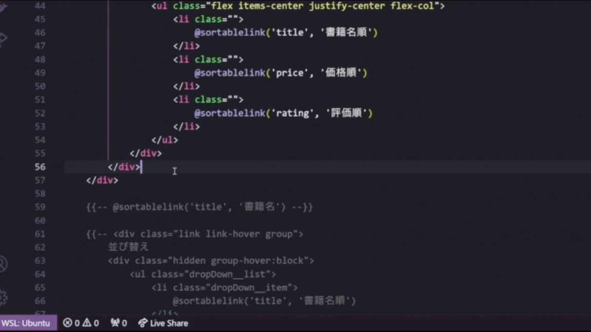

# Laravel Navigator for Beginners
Laravel初学者の開発・学習のサポートを行う拡張機能です。  
現在、開発中のため一部機能に制限があります。

## こういうお困りごとにアプローチ
- 「blade.phpでタグ、ミスったぽい！！」
- 「Laravelプロジェクトの全体像が掴めねぇ…」
- 「プロジェクト全体を一括でエラーがないか調べたい」

## blade.phpに特化した**構文チェック**機能
blade.phpファイルのチェックを行います。

自分で設定したクラスは、クイックフィックスの`ホワイトリストに追加`を行うことで波線を消すことができます。

### チェック対象
1. `@if`等、bladeディレクティブ
2. `<x-○○>`、`<from>`等、タグ
3. TailwindCSS

### 関連設定
- Diagnostics Level_directive
  - 初期値：Information
  - 説明：blade.phpでのディレクティブのチェック結果の表示を切り替えられます。
  Noneにすることでディレクティブをチェックしません。
- Diagnostics Level_html Tag
  - 初期値：Information
  - 説明：blade.phpでのタグのチェック結果の表示を切り替えられます。
  Noneにすることでタグをチェックしません。
- Diagnostics Level_past Tailwind
  - 初期値：Hint
  - 説明：blade.phpでの古いバージョンのtailwindのチェック結果の表示を切り替えられます。
  Noneにすることで古いバージョンのtailwindをチェックしません。
- Diagnostics Level_tailwind
  - 初期値：Information
  - 説明：blade.phpでのtailwindのチェック結果の表示を切り替えられます。
  Noneにすることでtailwindをチェックしません。
- Enable Typo Check
  - 初期値：True(チェックが入っている)
  - 説明：blade.phpでのチェックを一括して切り替えられます。
  本項目をTrueにしたうえで各項目のDiagnostics LevelをNone以外にすることでチェックします。
  - 構文チェックによる処理負荷を無くしたい場合は本項目のチェックを外してください。

## Laravelプロジェクトを俯瞰できる**ビジュアル化**機能
LaravelプロジェクトをMermaidに変換してわかりやすく整理します。

エディタを右クリックすると出るメニューの中にある`transMermaid`を実行することで起動します。

各ノードをクリックすることでそのファイルに遷移することも可能です。

### 関連設定
- Start Up Mermaid
  - 初期値：False（チェックが入っていない）
  - 説明：Trueにした場合、Laravelプロジェクトを開いたときに`transMermaid`を実行します。

## 困ったときの道しるべになる**整合性チェック**機能
ControllerとViewを解析し、問題となる点がないかチェックします。

エディタを右クリックすると出るメニューの中にある`checkVariables`を実行することで起動します。

現在技術不足のため、参考程度にしてください。
何かおかしい点があればご連絡いただければ幸いです。

### チェックできること
1. 変数に過不足があるか
2. 使用しているBladeのファイルが存在しないか
3. 使用していないBladeのファイルがあるか

### 関連設定